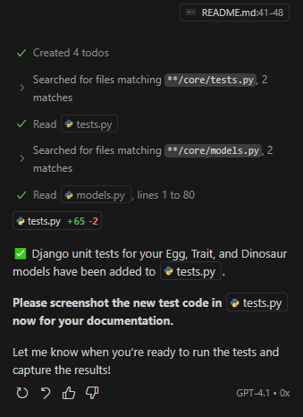
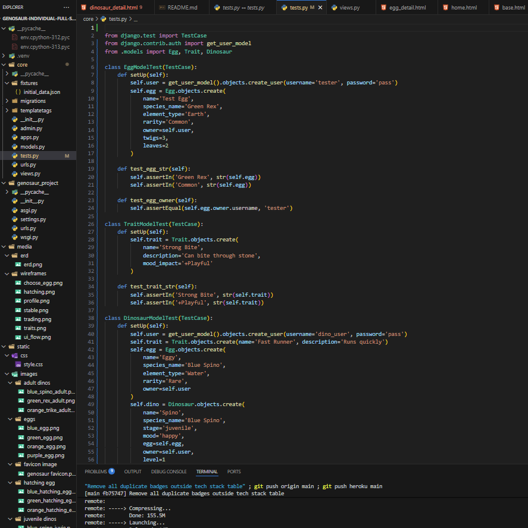
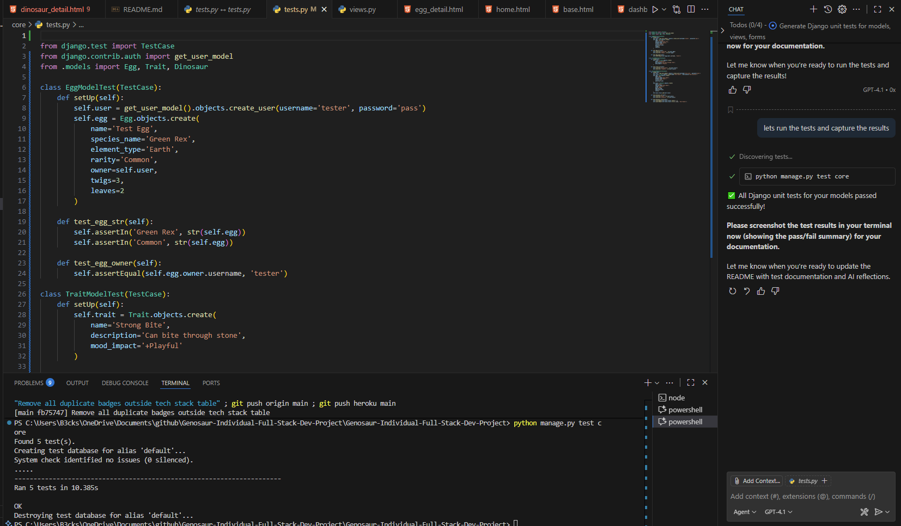
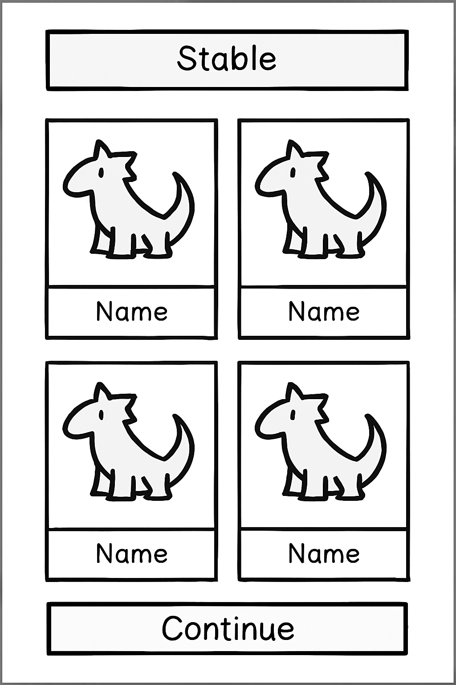
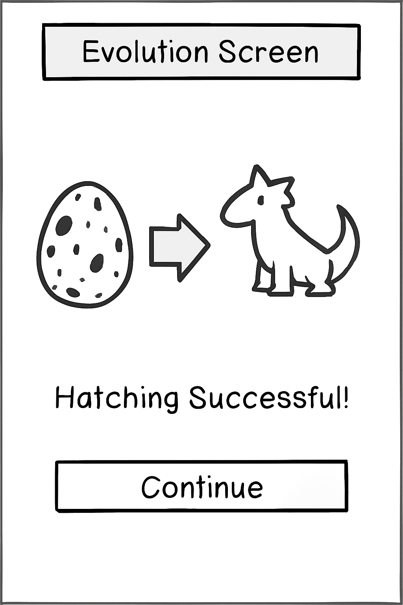
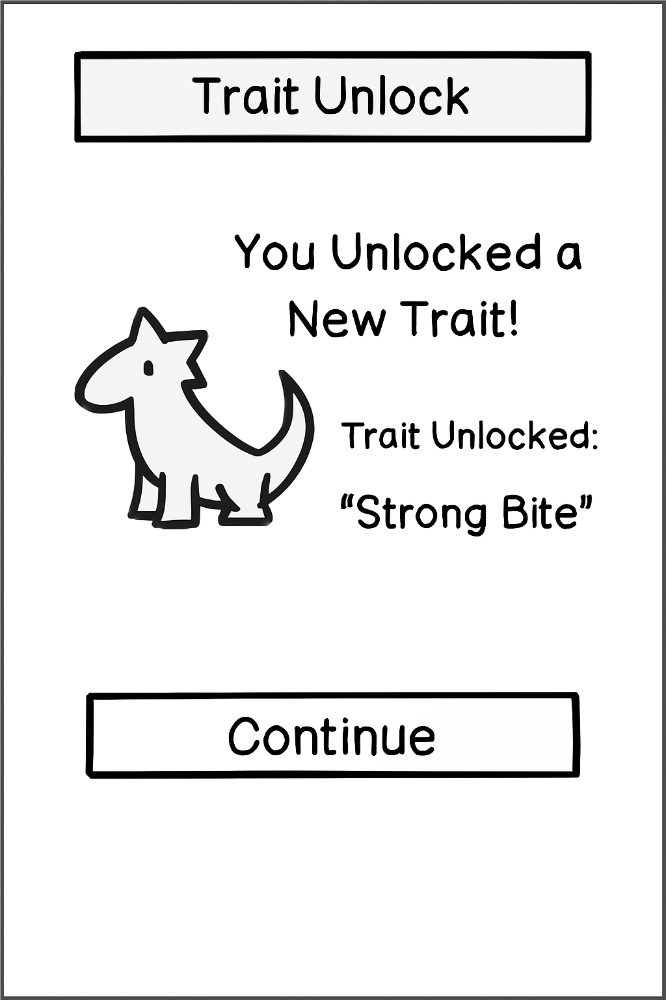

<div align="center">

# 🦖 **GENOSAUR** 🦖
### *Individual Full Stack Development Project*


</div>


<div align="center">

### 🌟 *Where elemental dinosaurs come to life through code* 🌟

**A full-stack web application where users hatch magical dinosaur eggs, nurture quirky companions, and build connections through trading. This project seamlessly blends technical excellence with emotional storytelling.**

</div>


<div align="center">

## 🌐 **LIVE DEMO**
### **[🚀 View Application](https://genosaur-individual-project-1a19b4196747.herokuapp.com/)**
*Deployed on Heroku with full Django functionality and PostgreSQL database*


</div>


<details>
  <summary>🧰 <strong>Tech Stack</strong></summary>
  <table align="center">
  <td align="center"><strong>🔧 Backend</strong></td>
  <td align="center"><strong>🎨 Frontend</strong></td>
  <td align="center"><strong>☁️ Deployment</strong></td>
  <td align="center"><strong>🛠️ Tools & Libraries</strong></td>
    </tr>
      <td align="center">
        <br>
        <br>
        
      </td>
      <td align="center">
        <br>
        <br>
        <br>
        <br>
        <br>
        
      </td>
      <td align="center">
  <br>
  <br>
  <br>
  <br>
  <br>
  <br>
  <br>
  <br>
  <br>
  <br>
  <br>
  <br>
      </td>
    </tr>
  </table>
</details>

---
<details>
  <summary>🧪 <strong>Setup Instructions</strong></summary>

### Local Development
```bash
# 1. Clone the repository
git clone https://github.com/Rebekah-codes/Genosaur-Individual-Full-Stack-Dev-Project.git
cd Genosaur-Individual-Full-Stack-Dev-Project

# 2. Create virtual environment
python -m venv .venv
.venv\Scripts\activate  # On Windows
# source .venv/bin/activate  # On Mac/Linux

# 3. Install dependencies
pip install -r requirements.txt

# 4. Run migrations
python manage.py migrate

# 5. Create superuser (optional)
python manage.py createsuperuser

# 6. Start development server
python manage.py runserver
```

### Heroku Deployment
This project is configured for Heroku deployment with:
- `Procfile` for web process
- `.python-version` specifying Python 3.12
- WhiteNoise for static file serving
- PostgreSQL database configuration

</details>


---
<details>
  <summary>🦕 <strong>Core Features</strong></summary>

  <ul>
    <li><strong>Egg Hatching & Dinosaur Creation:</strong> Claim magical eggs, gather nest materials, and hatch them to reveal unique dinosaurs. Each hatched egg automatically creates a new dinosaur linked to the user.</li>
    <li><strong>Dinosaur Inventory:</strong> View all your dinosaurs in a personalized inventory page, complete with images, names, species, stage, and mood. Dinosaurs start as juveniles and can evolve further.</li>
    <li><strong>Dinosaur Growth & Actions:</strong> Feed, play, and train your dinosaurs to improve their mood and level. Actions unlock new traits and allow dinosaurs to evolve from juvenile to adult.</li>
    <li><strong>Traits & Mood System:</strong> Dinosaurs have traits that affect their mood and gameplay. Actions and traits are tracked for each dinosaur, adding depth to the raising experience.</li>

---
<details>
  <summary>📋 <strong>Project Criteria & Evidence</strong></summary>

  This section documents how the project meets each required learning outcome (LO1–LO8) for assessment, including reflections on design, AI/Copilot use, and testing.

  <h4>LO1 – Planning & Design</h4>
  - <strong>Semantic HTML, Accessibility, Responsive Design:</strong> Bootstrap and semantic tags are used throughout templates. Navigation is consistent and accessible.
  - <strong>Database Design:</strong> Custom models (<code>Egg</code>, <code>Dinosaur</code>, <code>Trait</code>, etc.) with relationships and migrations. See <code>core/models.py</code> and migrations.
  - <strong>Agile & User Stories:</strong> Features tracked via TODOs and iterative commits. User stories reflected in gameplay features.
  - <strong>Code Quality:</strong> PEP8 naming, logic, and comments. Modular views and models.
  - <strong>Documentation:</strong> This README documents design rationale. Wireframes and diagrams are available in <code>/media</code> (add if missing).

  <h4>LO2 – Data Model & Features</h4>
  - <strong>Schema & Migrations:</strong> All models have migrations. See <code>core/migrations/</code>.
  - <strong>CRUD via UI:</strong> Eggs and dinosaurs can be created, viewed, updated, and deleted via the web UI. Access is restricted to logged-in users.
  - <strong>Notifications:</strong> Toasts and alerts for actions (e.g., hatching, login).
  - <strong>Forms & Validation:</strong> Django forms with validation, labels, and error messages.

  <h4>LO3 – Auth & Permissions</h4>

  ---
  - <strong>Login/Registration:</strong> Django auth system with secure credential handling.
  - <strong>Conditional Rendering:</strong> Navbar and dashboard reflect login state.
  - <strong>Access Control:</strong> <code>@login_required</code> decorators and redirects for unauthorized access.

  <h4>LO4 – Testing</h4>
  - <strong>Python Unit Tests:</strong> <code>core/tests.py</code> is present. [Planned] Add tests for models, views, and forms using Django’s test framework and Copilot-generated test cases.
  - <strong>Testing Documentation:</strong> Test cases and results will be documented here and in README as tests are added.

  <h4>LO5 – Version Control</h4>
  - <strong>Git & GitHub:</strong> All code is versioned, with meaningful commit messages. <code>.gitignore</code> secures secrets and environment files.

  <h4>LO6 – Deployment</h4>
  - <strong>Cloud Deployment:</strong> Deployed on Heroku. Procfile, WhiteNoise, and PostgreSQL config in place. See deployment instructions above.
  - <strong>Deployment Documentation:</strong> Steps and troubleshooting are documented in README.
  - <strong>Security:</strong> No secrets in codebase; environment variables used. <code>DEBUG = False</code> in production.

  <h4>LO7 – Object-Based Concepts</h4>
  - <strong>Custom Data Model:</strong> Django ORM models with relationships and custom logic.

  <h4>LO8 – AI in Development</h4>
  - <strong>Copilot/AI for Code Creation:</strong> GitHub Copilot was used to generate models, views, and forms, accelerating development and improving code quality.
  - <strong>Copilot/AI for Debugging:</strong> Copilot suggested fixes for static/media issues and migration errors.
  - <strong>Copilot/AI for Optimisation:</strong> Copilot helped refactor code for readability and performance.
  - <strong>Copilot/AI for Unit Tests:</strong> [Planned] Copilot will be used to generate Django unit tests for models and views.
  - <strong>Reflection:</strong> Copilot improved productivity, suggested best practices, and helped debug complex issues. Manual review ensured code quality and project fit.
</details>


---
<details>
  <summary>📸 <strong>Development Evidence</strong></summary>

> 📸 Screenshot: Django admin panel showing seeded eggs and traits  
> 📝 Reflection: Why I chose these model relationships and how they support gameplay

> 📸 Screenshot: Bootstrap-styled homepage and login screen  
> 🎨 Reflection: How the UI reflects Genosaur’s emotional tone

> 📸 Screenshot: Heroku dashboard and live deployment  
> 🧠 Reflection: Challenges I faced connecting PostgreSQL and solving push errors

---
### 🤖 Copilot Testing Evidence

> 📸 Screenshot: Copilot-generated unit test code  
> 

> 📸 Screenshot: Terminal showing all tests passing  
> 

> 📸 Screenshot: README documentation update for Copilot testing  
> 

**Reflection:**  
GitHub Copilot was used to generate Django unit tests for the Egg, Trait, and Dinosaur models. The tests were run and all passed successfully, as shown above. Copilot accelerated the test-writing process and helped ensure coverage of key model logic. Manual review and adjustment ensured the tests were relevant and accurate for the project domain.
  ---
  **Wireframes & ERD**

# 🦕 Dino Game Wireframe Pack

This document outlines the core user flow and screen designs for the Dino virtual pet game.  
The wireframes are presented in a **low‑fidelity, Balsamiq‑style sketch** to emphasize layout and flow over final visuals.

---

## 📖 Overview
Players begin by selecting an egg, hatch it into a dinosaur, and then raise, evolve, and trade their dinos.  
The UI is designed to be **modular, progression‑driven, and emotionally resonant**, with clear feedback loops.

---

## 🥚 Egg Selection
- **Purpose:** Starting point where players choose their first egg.  
  - Progress bars: Level, Feeds, Actions.  
  - Traits list (unlocked abilities).  
  - Action dropdown (Feed | Play | Train) + “Do” button.  
  - Recent Actions log.  
- **Flow:** From here, players can trigger evolution, unlock traits, or return to Stable.

---

## ✨ Evolution / Hatching Screen
- **Purpose:** Celebrate milestone transitions (egg → hatchling → juvenile → adult).  
- **Layout:** Old sprite fades → transition animation → new sprite appears.  
- **Message:** “Hatching Successful!” or “Spino evolved into Juvenile!”  
- **Action:** Continue → returns to Profile.

---

## 🎉 Trait Unlock Popup
- **Purpose:** Provide instant feedback when a new trait is gained.  
- **Layout:** Dino sprite + message (“You unlocked a new trait: Strong Bite”).  
- **Action:** Continue → returns to Profile.

---
## 📦 Stable / Collection
- **Purpose:** Overview of all owned dinos.  
- **Layout:** Grid of dino sprites with names, stages, and levels.  
- **Action:** Select a dino → opens Profile.  
- **Extra:** “Add New Egg” button to expand collection.

---

## 💱 Trading Page
- **Purpose:** Enable player‑to‑player exchanges.  
- **Layout:**
  - **Offering column:** Select one of your dinos.  
  - **Requesting column:** Specify desired dino/egg.  
  - Incoming trade offers with Accept/Decline buttons.  
- **Action:** “Propose Offer” button posts a trade.

---

## 🔄 UI Flow Diagram


```
[ Egg Selection ]
  |
  v
[ Dino Profile ] <----> [ Stable / Collection ]
  |
  v
[ Evolution Screen ]    [ Trading Page ]
  |
  v
[ Trait Unlock Popup ]
```


Wireframes for the main user flows and UI screens are located in `/media/wireframes/`. These visual plans guided the design and layout of the application.

### Wireframe Gallery

#### Egg Selection


#### Dino Profile


#### Stable / Collection


#### Hatching Screen


#### Trait Unlock Popup


#### Trading Page


#### UI Flow Diagram


Below is the Entity Relationship Diagram (ERD) showing the database structure and relationships:


---

## 🚀 Next Steps
- Add **rarity indicators** (colors, stars, borders) to eggs and dinos.  
- Expand **progression mechanics** (adult stage, rare evolutions).  
- Integrate **UI polish** (animations, sound cues, particle effects).  


---
<details>


  <summary>🧠 <strong>Design Decisions</strong></summary>

- Used `ManyToManyField` for traits to allow flexible dino personalities  
- Integrated Bootstrap for responsive, playful UI  
- Chose Heroku for simple cloud deployment and PostgreSQL support  

</details>

---

<details>
  <summary>🚀 <strong>Future Features</strong></summary>

- 📜 Dino journal entries and lore system  
- 🌋 Elemental affinity battles or bonding  
- 🎨 Pixel art sprite rendering  
- 🔗 REST API for frontend expansion  

</details>

---

<details>
  <summary>🧑‍🎓 <strong>Author</strong></summary>

**Rebekah** — Full-stack developer, storyteller, and emotional architect.  
This project blends technical clarity with warmth, humor, and creative world-building.

</details>

---


## 📜 License

MIT License — free to use, remix, and evolve.
